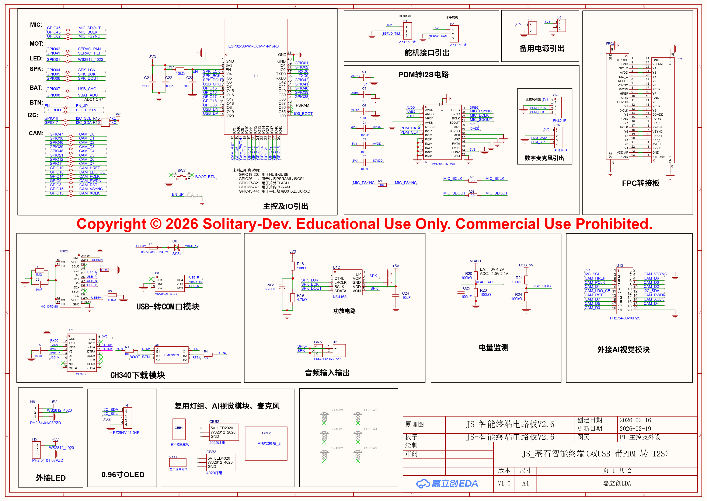
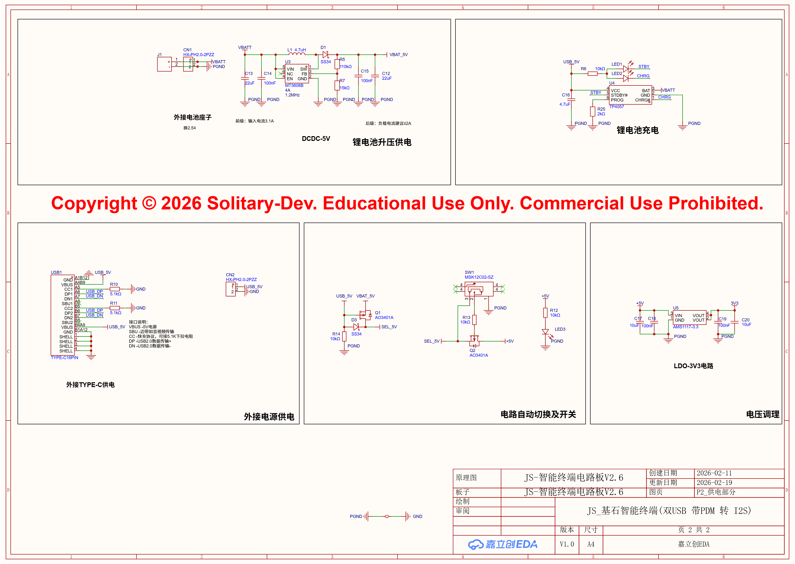

**Legal Notice**: All hardware designs and documentation are provided for educational and research purposes only. Commercial production or redistribution without written consent from Solitary-Dev is strictly prohibited.

---

## 📦 Key Component List (BOM Highlights)

This platform utilizes high-grade industrial components to ensure stability and performance.

[中文版 (Chinese Version)](./BOM_zh.md)

### 🧠 Core Processing & Vision
- **SoC**: ESP32-S3-WROOM-1-N16R8 (Dual-core, AI-accelerated, 16MB Flash/8MB PSRAM).
- **Camera Module Support**: Optimized for **OV5640-AF** (5MP with Voice Coil Motor autofocus).
- **Vision LDOs**: Independent high-PSRR LDOs for 2.8V and 1.5V camera power rails.

### 🎙️ High-Fidelity Audio
- **Audio ADC**: **PCM1840** (Quad-channel, High-performance Burr-Brown™ architecture).
- **Microphones**: Dual **IM69D130** (PDM Digital MEMS) for stereo sound localization.
- **Amplifier**: NS4168 (High-efficiency mono Class-D).

### ⚡ Power Management
- **Boost Converter**: MT3608 (High-current output for haptic actuators).
- **Charging**: TP4057 (Lithium battery charging logic).
- **Protection**: SS34 Schottky diodes & SRV05 ESD protection on USB rails.
- **Safety**: Onboard self-recovery fuse & physical power path switching logic.

### 💡 Actuation & Interface
- **Actuators**: Compatible with JX PDI-1109MG or similar high-torque digital servos.
- **Visual Feedback**: WS2812B-2020 & 4020 ARGB LED arrays.
- **Display**: Supports 0.96-inch OLED (I2C).

## 🔌 Recommended Peripherals 

To complete the full interaction experience, we recommend the following external modules:

1. **Camera Module**: **OV5640-AF** (5MP, Auto-Focus version). 
   - *Connection*: 24-Pin FPC interface.
2. **Actuators**: 2x **JX Servo PDI-1109MG** (Metal Gear Digital Servos).
   - *Connection*: Standard 3-pin servo headers (H1 for Horizontal, H2 for Vertical).
3. **Power Source**: 3.7V Li-ion Battery (High-discharge rate recommended for servos).
4. **Display**: 0.96" OLED Module (SSD1306, I2C interface).

---

## 🔍 Technical Schematics Reference

Below is the architectural overview of the Iris-HCI-Platform.

### Logic & Sensing Architecture

### Advanced Power Management

> **Note**: For intellectual property protection, internal module details are abstracted.
